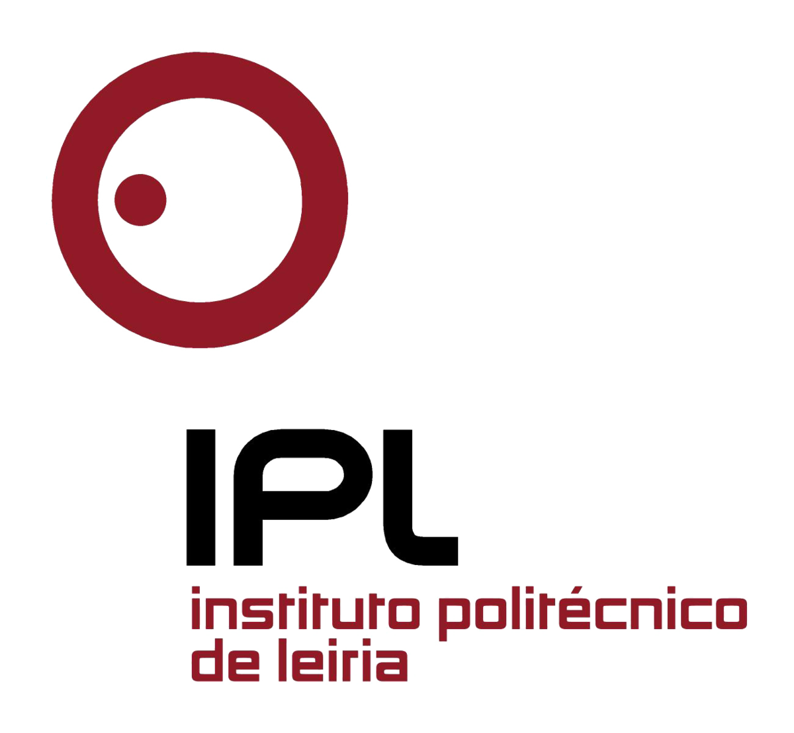

<!--
*** Thanks for checking out the Best-README-Template. If you have a suggestion
*** that would make this better, please fork the repo and create a pull request
*** or simply open an issue with the tag "enhancement".
*** Don't forget to give the project a star!
*** Thanks again! Now go create something AMAZING! :D
-->

<!-- PROJECT SHIELDS -->
<!--
*** I'm using markdown "reference style" links for readability.
*** Reference links are enclosed in brackets [ ] instead of parentheses ( ).
*** See the bottom of this document for the declaration of the reference variables
*** for contributors-url, forks-url, etc. This is an optional, concise syntax you may use.
*** https://www.markdownguide.org/basic-syntax/#reference-style-links
[![Contributors][contributors-shield]][contributors-url]
[![Forks][forks-shield]][forks-url]
[![Stargazers][stars-shield]][stars-url]
[![Issues][issues-shield]][issues-url]
[![MIT License][license-shield]][license-url]
[![LinkedIn][linkedin-shield]][linkedin-url]

<!-- PROJECT LOGO -->
 

  

  <h3 align="center">Protótipo de deteção de rosto</h3>

  

    Este protótipo identifica os rostos, aplica landmarks e ainda seleciona algumas regiões de interesse.
  

<!-- TABLE OF CONTENTS -->

  
Table of Contents

  <ol>
    <li>
      <a href="#about-the-project">About The Project</a>
      <ul>
        <li><a href="#built-with">Built With</a></li>
      </ul>
    </li>
    <!--<li>
      <a href="#getting-started">Getting Started</a>
      <ul>
        <li><a href="#prerequisites">Prerequisites</a></li>
        <li><a href="#installation">Installation</a></li>
      </ul>
    </li>
    <li><a href="#usage">Usage</a></li>
    <li><a href="#roadmap">Roadmap</a></li>-->
    <li><a href="#contributing">Contributing</a></li>
    <!--<li><a href="#license">License</a></li>-->
    <li><a href="#contact">Contact</a></li>
    <!--<li><a href="#acknowledgments">Acknowledgments</a></li>-->
  </ol>

<!-- ABOUT THE PROJECT -->
## About The Project

[![Product Name Screen Shot][product-screenshot]](https://www.ipleiria.pt/curso/licenciatura-em-engenharia-informatica/)

O projeto insere-se no âmbito do Ambient Assisted Living (AAL) cujo objetivo principal é o desenvolvimento de um robô social, de baixo custo, que promova o bem-estar de idosos. Neste contexto pretende-se que o robô consiga reconhecer, através de técnicas de Inteligência Artificial (IA) e machine learning, as emoções de um idoso, interagindo oportunamente e sendo capaz de demonstrar empatia de forma efetiva, melhorando e promovendo o bem-estar do idoso.

Esta deteção de estados emocionais poderá ser conseguida através de vários métodos como a análise linguística, deteção de tom vocal ou visão por computador. A interação com o idoso poderá ser inicializada de forma automática (ex: quando são reconhecidas emoções menos positivas, quando o idoso não fala há muito, etc.) e será efetuada através de vários mecanismos como mensagens textuais através de um chatbot, apresentação de expressões através de um ecrã que integra o robô, ou mesmo ações (ex: dançar, tocar uma música, etc.).

O objetivo neste projeto é o desenvolvimento de uma solução inteligente que consiga, através de imagens, detetar uma cara e reconhecer as principais emoções através de técnicas de machine learning.

(<a href="#top">back to top</a>)

### Built With

Aqui pode encontrar as ferramentas usadas para este projeto

* [Python](https://www.python.org)
  * [OpenCV](https://docs.opencv.org/4.x/d6/d00/tutorial_py_root.html)
  * [dlib](http://dlib.net)
    * help ? -> https://stackoverflow.com/questions/41912372/dlib-installation-on-windows-10
    * https://pyimagesearch.com/2017/04/03/facial-landmarks-dlib-opencv-python/
  * [NumPy](https://numpy.org)

(<a href="#top">back to top</a>)

<!-- GETTING STARTED 
## Getting Started

This is an example of how you may give instructions on setting up your project locally.
To get a local copy up and running follow these simple example steps.
-->

### Prerequisites

Python installed
If you dont have any: https://www.python.org/downloads/

(<a href="#top">back to top</a>)

### Installation

_Para instalar com sucesso este projeto deve:_

1. Install all libraries `pip install name`.
   Check out the libraries <a href="#built-with">here</a>
2. Download the respective cascades from [OpenCV-Cascades](https://github.com/opencv/opencv/tree/master/data/haarcascades)

(<a href="#top">back to top</a>)

<!-- USAGE EXAMPLES 
## Usage

Use this space to show useful examples of how a project can be used. Additional screenshots, code examples and demos work well in this space. You may also link to more resources.

_For more examples, please refer to the [Documentation](https://example.com)_

(<a href="#top">back to top</a>)

-->

<!-- ROADMAP 
## Roadmap

- [x] Add Changelog
- [x] Add back to top links
- [ ] Add Additional Templates w/ Examples
- [ ] Add "components" document to easily copy & paste sections of the readme
- [ ] Multi-language Support
    - [ ] Chinese
    - [ ] Spanish

See the [open issues](https://github.com/othneildrew/Best-README-Template/issues) for a full list of proposed features (and known issues).

(<a href="#top">back to top</a>)

-->

<!-- CONTRIBUTING -->
## Contributing

Todos os contributos irão para o **Politécnico de Leiria**. Agradecemos imenso a oportunidade para desenvolver este projeto.
Estamos gratos aos professores:

  * Roberto Ribeiro
  * José Ribeiro
  * António Pereira

(<a href="#top">back to top</a>)

<!-- LICENSE 
## License

Distributed under the MIT License. See `LICENSE.txt` for more information.

(<a href="#top">back to top</a>)

-->

<!-- CONTACT -->
## Contact

Rafael Pereira - [LinkedIn](https://www.linkedin.com/in/rafaelmendespereira/) - 2191266@my.ipleiria.pt

Carla Mendes - [LinkedIn](https://www.linkedin.com/in/carla-mendes-5b3586233/) - 2191170@my.ipleiria.pt

<!--
Project Link: [https://github.com/your_username/repo_name](https://github.com/your_username/repo_name)
-->

(<a href="#top">back to top</a>)

<!-- ACKNOWLEDGMENTS 
## Acknowledgments

Use this space to list resources you find helpful and would like to give credit to. I've included a few of my favorites to kick things off!

* [Choose an Open Source License](https://choosealicense.com)
* [GitHub Emoji Cheat Sheet](https://www.webpagefx.com/tools/emoji-cheat-sheet)
* [Malven's Flexbox Cheatsheet](https://flexbox.malven.co/)
* [Malven's Grid Cheatsheet](https://grid.malven.co/)
* [Img Shields](https://shields.io)
* [GitHub Pages](https://pages.github.com)
* [Font Awesome](https://fontawesome.com)
* [React Icons](https://react-icons.github.io/react-icons/search)

(<a href="#top">back to top</a>)

-->

<!-- MARKDOWN LINKS & IMAGES -->
<!-- https://www.markdownguide.org/basic-syntax/#reference-style-links -->
[contributors-shield]: https://img.shields.io/github/contributors/othneildrew/Best-README-Template.svg?style=for-the-badge
[contributors-url]: https://github.com/othneildrew/Best-README-Template/graphs/contributors
[forks-shield]: https://img.shields.io/github/forks/othneildrew/Best-README-Template.svg?style=for-the-badge
[forks-url]: https://github.com/othneildrew/Best-README-Template/network/members
[stars-shield]: https://img.shields.io/github/stars/othneildrew/Best-README-Template.svg?style=for-the-badge
[stars-url]: https://github.com/othneildrew/Best-README-Template/stargazers
[issues-shield]: https://img.shields.io/github/issues/othneildrew/Best-README-Template.svg?style=for-the-badge
[issues-url]: https://github.com/othneildrew/Best-README-Template/issues
[license-shield]: https://img.shields.io/github/license/othneildrew/Best-README-Template.svg?style=for-the-badge
[license-url]: https://github.com/othneildrew/Best-README-Template/blob/master/LICENSE.txt
[linkedin-shield]: https://img.shields.io/badge/-LinkedIn-black.svg?style=for-the-badge&logo=linkedin&colorB=555
[linkedin-url]: https://linkedin.com/in/othneildrew
[product-screenshot]: images/screenshot.png
[product-screenshot2]: faces.jpg