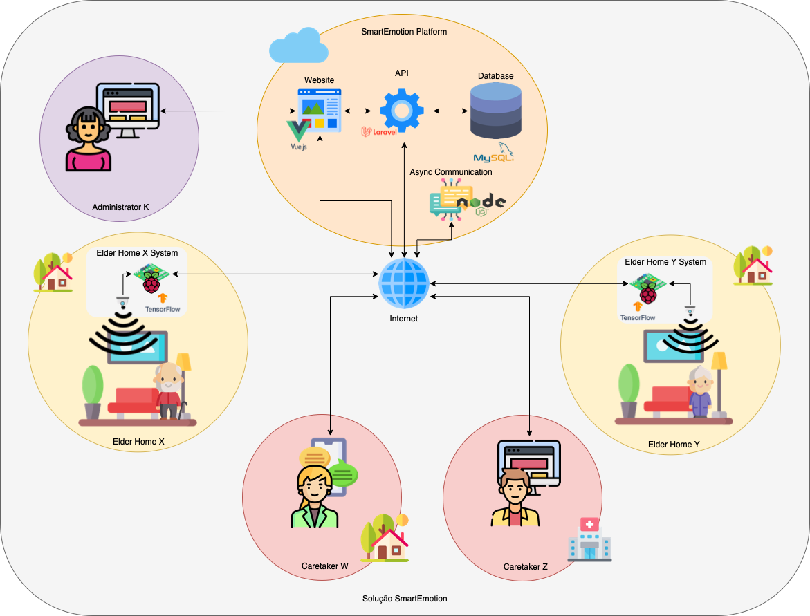

# 🌟 SmartEmotion Platform 🌟

🚀 **Empowering Caregivers!** 🚀

## 🌐 Introduction
Welcome to the **SmartEmotion** platform - the future of elderly care! We're revolutionizing the way caregivers interact and monitor the emotional state of the elderly. With real-time notifications, cutting-edge tech stack, and a user-friendly interface, we're setting new standards in elderly care.

## 🎯 Features

### 📡 Data Collection
- 🤖 Receives data seamlessly from a microcontroller.
- 🌐 APIs in Laravel and lightning-fast Websockets in Node.js.
- 🗃️ All data is securely stored in a MySQL vault.

### 🖥️ Client Platform
- 🎨 Crafted with love using Nuxt.js + Vuetify.
- 📱 Fully responsive - accessible from any device, anywhere!

### 🌍 Hosting & Deployment
- 🏰 Hosted on the prestigious domain of the Polytechnic of Leiria.
- 🐧 Powered by Ubuntu 20.04 - because we trust penguins!

### 📞 Real-time Communication
- ⚡ Uses Websockets for instantaneous, asynchronous communication.
- 📜 Covers everything: logs, frame magic, instant notifications, and user tales.

### 🏢 Elder Home System
- 🏡 An integrated system ensuring the elderly feel right at home.
- 🚨 Provides critical alerts and insights directly from their living space.

### 📊 Data Persistence & Analytics
- 📈 Dive deep with data stored in a relational MySQL database.
- 🧠 Smart relationships: notifications, iterations, frame deep-dives, and user-tailored notifications.

### 🔐 Ultra-Secure Authentication
- 🛡️ Fortified with OAuth 2.0 authentication.
- 🚫 No unwanted guests! Only authorized personnel allowed.

### 🎩 User Dashboard
- 📟 A sleek dashboard offering a bird's-eye view of recent events.
- 🌟 Caregivers: Get insights, notifications, and peep into the microcontroller's soul.
- 🎓 Administrators: Command and control over all microcontroller data.

### 🔄 Iterations & Feedback Loop
- 🌌 Representing the mesmerizing emotional journey of our beloved elderly.
- 👩‍🔬 Human labeling of frames for that personal touch.

### 📣 Instant Notifications
- 📸 Frames that talk! Triggering notifications sent via Websockets and HTTP.
- 💌 Delivered right to your platform, email, and even as cozy SMS.

### 🛠️ Administrator's Toolbox
- 👥 Manage your team: caregivers and administrators.
- 📜 Stay informed with all microcontroller logs.

## 🎨 Visuals
Dive into our visual ocean with figures that paint a thousand words. From tech diagrams to user dashboards, we've got it all!

## 🎉 Wrapping Up
**SmartEmotion** is not just a platform; it's a movement. Join us in redefining elderly care, one emotion at a time.

# 📚 Report & Poster Presentation 🖼️

## 📖 SmartEmotion Report
Dive deep into the intricacies of the SmartEmotion platform with our comprehensive report. This document provides a detailed overview, from the conceptualization to the implementation of our platform. Whether you're a tech enthusiast or just curious about our journey, this report is your go-to resource.

🔗 [View the Report](assets/main.pdf)

## 🎨 SmartEmotion Poster
Get a visual summary of the SmartEmotion platform with our poster. Designed with clarity and aesthetics in mind, this poster captures the essence of our project. It's perfect for a quick glance or to showcase the highlights of our platform in conferences, seminars, or any event.

🔗 [View the Poster](assets/CartazSmartEmotion_ESTG_Leiria_2022_2191170_2191266.pdf)

---

We're proud to present both the report and the poster as testaments to our dedication and hard work on the SmartEmotion platform. Feel free to explore and share!